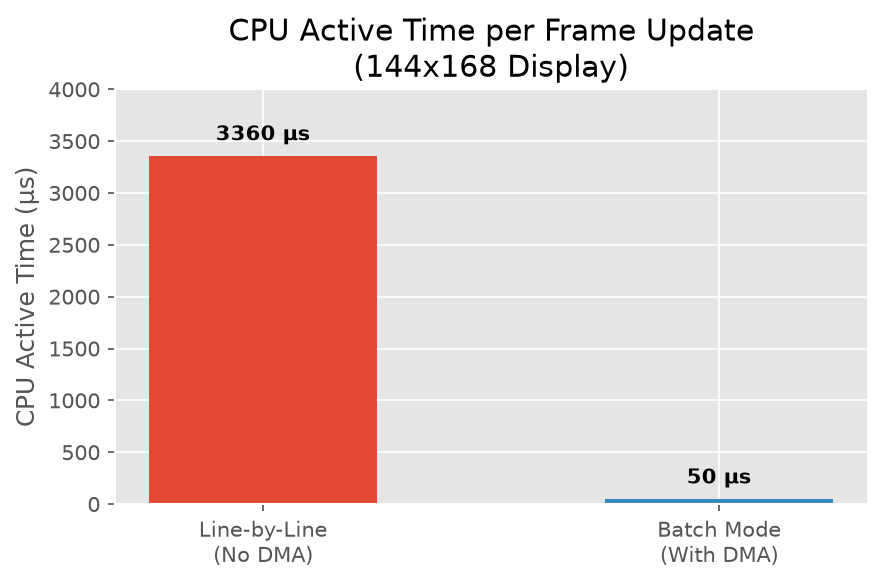
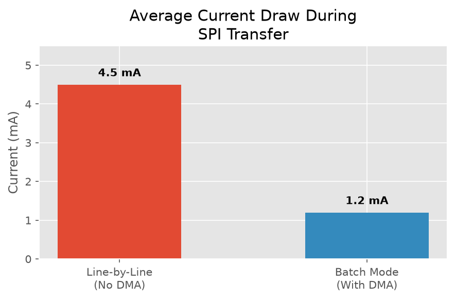

# Performance: Why `dma-mode` matters

Without `dma-mode`, the driver sends pixel data to the display one line at a time. This means the number of individual SPI transactions per frame is equal to your display's pixel height (e.g., 168 separate transactions for a 144x168 display). This forces the MCU to wake up and handle hardware interrupts for every single line.

Enabling `dma-mode` reduces this to **1 transaction per frame**, cutting the CPU interrupt overhead by over 99% regardless of your display size.

## Pros and Cons

**Pros:**
* Drastically reduces active CPU time during display updates.
* Increases battery life by allowing the CPU to sleep while the DMA hardware handles the SPI transfer.
* Reduces bus contention if other devices share the SPI bus.

**Cons:**
* Increases static RAM (SRAM) usage by roughly `(Display Height) * (Display Width in Bytes + 2)` bytes. For a 144x168 display, this uses about 3.3 KB of RAM. (This is generally insignificant on modern microcontrollers like the nRF52840 which has 256 KB of RAM, but could be a factor on severely RAM-constrained chips).

## Hardware Configuration: Choosing the right SPI Peripheral for EasyDMA

In order to actually take advantage of `dma-mode` on Nordic nRF52 devices (such as the nRF52840 used in many ZMK keyboards), you must ensure your SPI peripheral is configured to use the EasyDMA driver (`nordic,nrf-spim`).

If your board defines the SPI bus as standard SPI (`nordic,nrf-spi`), `dma-mode` will not work. You can explicitly override this in your overlay file where the SPI bus is defined:

```c
&spi0 {
    compatible = "nordic,nrf-spim"; /* Use SPIM (with EasyDMA) instead of SPI */
    status = "okay";
    /* ... pinctrl and cs-gpios ... */
};
```

> [!WARNING]
> **Energy Consumption Note:** On the nRF52840, the `spi3` peripheral is a special high-speed SPI instance. Using `spi3` (SPIM3) requires the high-frequency clock and will draw significantly more base current (often an additional 1-2 mA) compared to `spi0`, `spi1`, or `spi2`. For low-power, battery-operated devices like wireless keyboards, you should strongly prefer `spi0`, `spi1`, or `spi2` for this driver to maximize battery life.

## Energy Consumption Comparison (Theoretical)

To understand the impact of `dma-mode`, let's look at a theoretical energy consumption comparison for sending a single full frame to the **vista508** display (resolution: 144x168).

Without DMA, the CPU must wake up to handle a hardware interrupt for every single line of the display. For a 168-pixel tall display, this means **168 separate CPU wakeups and SPI transactions per frame**. With DMA, the CPU wakes up once to set up the transfer, and then goes immediately back to deep sleep while the hardware handles the entire 168-line transfer automatically in the background.

### CPU Active Time

Every CPU wakeup incurs a processing penalty (context switching, executing the interrupt handler, restoring registers, etc.).



- **Without DMA:** ~20 µs active CPU time per line * 168 lines = **~3,360 µs**.
- **With DMA:** One-time DMA descriptor setup of **~50 µs**, after which the CPU sleeps.

### Average Current Draw (During Update)

Because the CPU can return to its low-power sleep state during the actual SPI transmission in DMA mode, the overall average current draw of the microcontroller during the frame update is significantly reduced.



- **Without DMA:** The CPU remains awake and processing interrupts constantly, drawing roughly **4.5 mA** for the entire duration of the SPI transfer.
- **With DMA:** The CPU sleeps while the EasyDMA peripheral drives the SPI bus, drawing only the baseline peripheral and clock current of roughly **1.2 mA**.

By enabling `dma-mode`, you not only free up the CPU to handle other tasks (like scanning the key matrix or maintaining the Bluetooth connection), but you dramatically reduce the energy footprint of every single screen refresh.
