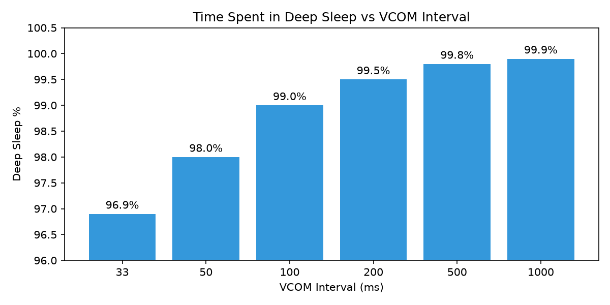
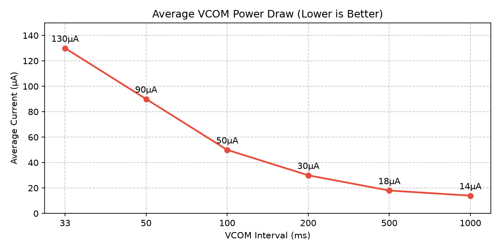

# Choosing the Right Inversion Interval

Selecting the proper VCOM inversion interval for your Sharp Memory LCD is a balancing act between visual quality (eliminating artifacts like flickering) and power consumption. The driver allows you to configure two different intervals depending on the state of the display: active or idle.

## Active State: Avoiding Visual Artifacts

When the display is active and visible, the primary concern is preventing visual artifacts.

### Refresh Interval Considerations

During testing across several display models (including LS013B7DH05 and LS027B7DH01A), display flickering was noticeable when using refresh intervals longer than 33ms, especially when viewed off-axis.

By dropping the interval to **17ms** (`serial-vcom-interval = <17>;`), the driver produces perfect results with excellent contrast and no visible flickering.

While higher refresh rates do increase energy consumption, the penalty during active use is very minor; even in the worst-case scenario (fast refresh, no sleep optimization), the increase was measured to be only around 80µA.

## Idle State: Power Analysis

When the screen is blanked or idle, visual artifacts are far less of a concern. This is where you can significantly optimize for power consumption.

When you see a faint pulsing at 1Hz on a blank screen, it's because the liquid crystals in the display are being inverted slowly. Speeding up the inversion reduces this visual flicker, but it means waking up the MCU more often.

It's a common misconception that the CPU uses power based only on how *long* it works. In modern microcontrollers like the nRF52, the actual work of toggling the VCOM bit takes less than **0.1 milliseconds**. The real power drain comes from the **wakeup penalty** (spinning up the high-frequency clock and regulators), which creates a current spike of roughly ~3-5 mA for about 1ms.

By dropping the VCOM frequency when the screen is blanked, you drastically increase the ratio of deep sleep:

Assuming deep sleep draws ~10µA and a wakeup spike averages 4mA for 1ms, here is the impact on your average VCOM power draw:

### The Sweet Spot

I recommend an `idle-vcom-interval` of `<100>` (or 200). At 100ms, any faint pulsing on a blank screen blends together enough to mostly disappear, while cutting your background battery drain by more than half compared to running at 33ms constantly.
